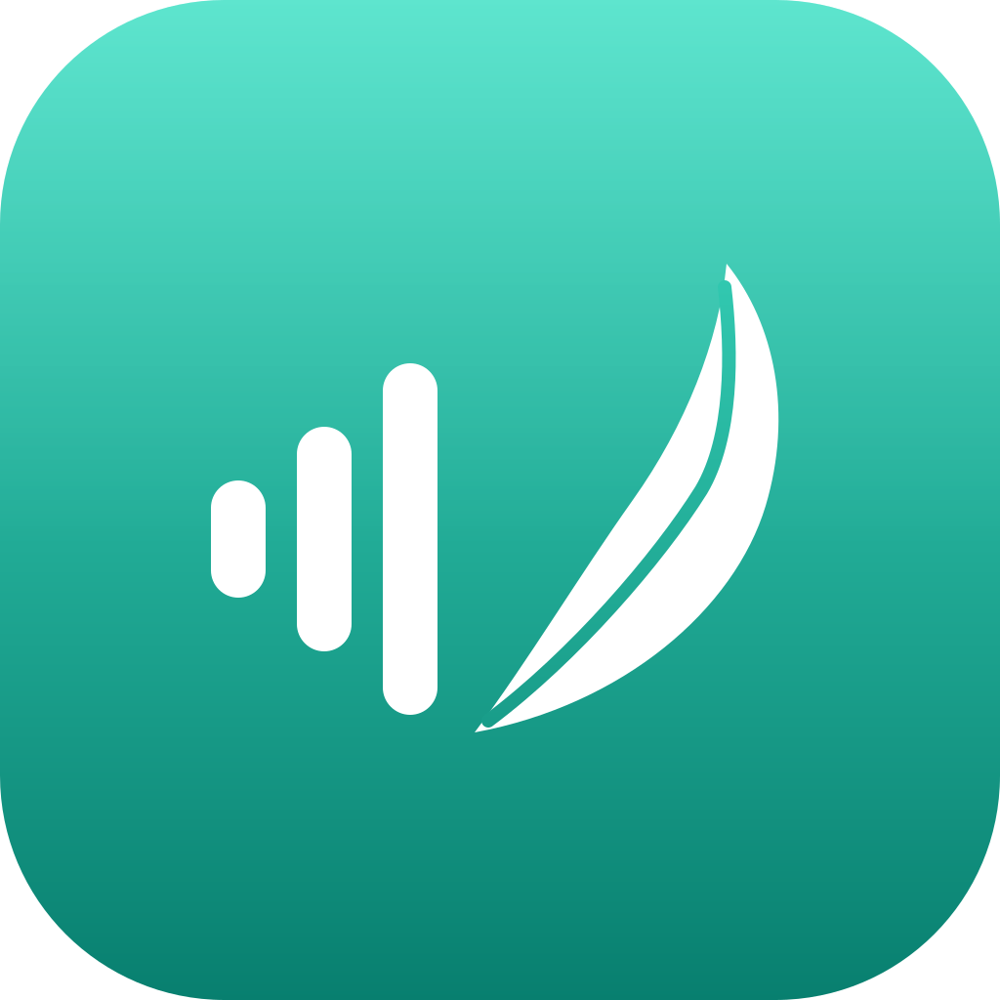

<div align="center">



# Calamo

**Local-only voice dictation for macOS.**

Hold a hotkey, speak, release — the cleaned-up text is inserted at your
cursor, and not a single byte of audio leaves the machine.

[](LICENSE)
[](https://github.com/Alex9583/Calamo/releases)
[](https://github.com/Alex9583/Calamo/actions/workflows/ci.yml)
[](#install)
[](https://www.swift.org/)
[](https://www.rust-lang.org/)
[](https://buymeacoffee.com/alextdev)

</div>

---

## Features

- Push-to-talk anywhere: hold the hotkey (Fn by default, or record your
  own chord), speak, release — the text lands at the cursor of whatever
  app has focus
- 100% local: speech recognition and cleanup run on-device; audio and
  text never leave the machine — no account, no cloud, no telemetry
- Cleanup by a local LLM: hesitations, false starts and self-corrections
  rewritten before insertion
- Language auto-detected on every dictation (multilingual models)
- Personal dictionary: enforced spellings with spoken aliases, biasing
  recognition and steering cleanup
- Never loses a dictation: if cleanup fails, the raw transcript is
  inserted, spellings still enforced
- Secure-field aware — never types into password fields
- Menu bar app with a first-launch wizard that downloads the models
  (~1.9 GB) and walks the permission grants

Speech recognition by NVIDIA's Parakeet models (CC BY 4.0, CoreML
conversions by FluidInference); cleanup by Qwen3.5-2B (Apache-2.0) —
[docs/distribution.md](docs/distribution.md).

## Install

Requires macOS 14+ on Apple Silicon.

### DMG

Download the latest DMG from the
[Releases](https://github.com/Alex9583/Calamo/releases) page — drag
Calamo into /Applications **first**, then walk the Gatekeeper path
pictured on the DMG (System Settings → Privacy & Security → "Open
Anyway").

### Homebrew

```sh
brew tap alex9583/calamo
brew install --cask calamo
```

## Build

Prerequisites:

- Xcode 26+ (`xcodebuild`, `swift`). After a fresh Xcode install, run
  `xcodebuild -runFirstLaunch` once (otherwise `-create-xcframework` fails
  on a broken simulator plug-in).
- Rust 1.97+ with the Apple Silicon target:
  `rustup target add aarch64-apple-darwin`.
- SwiftLint (`brew install swiftlint`) — function-length lint, a CI barrier.

```sh
./build.sh            # cargo → uniffi-bindgen-swift → XCFramework → SwiftPM → build/Calamo.app
open build/Calamo.app # menu bar app (waveform icon)
```

## Tests

```sh
cargo test --manifest-path core/Cargo.toml   # Rust workspace (no I/O, no models)
swift test --package-path app                # Swift side, through the real FFI (./build.sh first)
scripts/golden.sh all                        # golden suites, reference machine only — docs/golden-suites.md
cargo clippy --workspace --all-targets --manifest-path core/Cargo.toml
swiftlint                                    # both lint function length — docs/standards/small-units.md
```

Before merging a release PR, the manual pass in
[docs/manual-checklist.md](docs/manual-checklist.md) walks the OS glue no
harness can drive — event tap, TCC, real apps, real microphones — and the
error policy end to end.

## CI & release

Every push runs [ci.yml](.github/workflows/ci.yml), the only automatic merge
barrier: SwiftLint, full build chain, clippy + `swift test` on macOS;
clippy + `cargo test` on Linux (portability). CI never touches models,
goldens, or audio fixtures — those stay local.

Merging a PR labeled `patch` / `minor` / `major` tags the next version
([tag-release.yml](.github/workflows/tag-release.yml)); tags `v*` run
[release.yml](.github/workflows/release.yml) — a signed DMG published as
a GitHub Release with a generated changelog. The ritual around it is
[docs/release.md](docs/release.md).

## Support

If Calamo saves you time, consider supporting its development:

[](https://buymeacoffee.com/alextdev)

## Contributing

Bug reports and feature requests go to
[GitHub Issues](https://github.com/Alex9583/Calamo/issues). Code follows
[CODING_STANDARDS.md](CODING_STANDARDS.md); the canonical glossary
(ubiquitous language) lives in [CONTEXT.md](CONTEXT.md).

## License

MIT — see [LICENSE](LICENSE). The downloaded models keep their own
licenses — [docs/distribution.md](docs/distribution.md).

## Layout

| Path | Role |
|---|---|
| `core/` | Cargo workspace: `calamo-core` (pure domain) ← `calamo-adapters` (Rust-side adapters) ← `calamo-ffi` (UniFFI staticlib) |
| `CalamoCore/` | Local SwiftPM package: XCFramework binaryTarget + generated Swift bindings — both written by `build.sh`, never committed |
| `app/` | The menu bar app (SwiftUI `MenuBarExtra`), consumes `CalamoCore` alongside FluidAudio |
| `build.sh` | The single dev/CI build chain |
| `packaging/` | Canonical source of the Homebrew tap (`homebrew-calamo/`) |
| `fixtures/` | Shared test fixtures (`fixtures/audio/local/` is a private corpus, never committed) |
